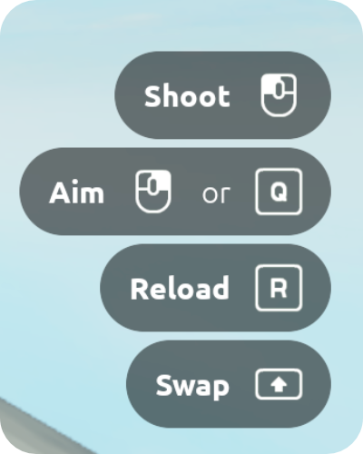
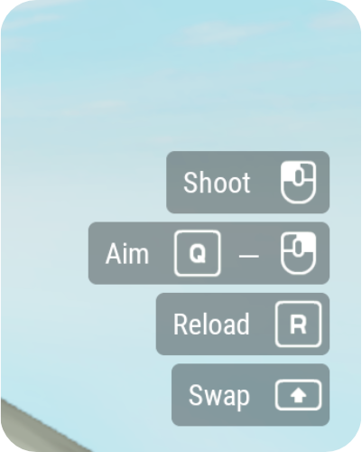
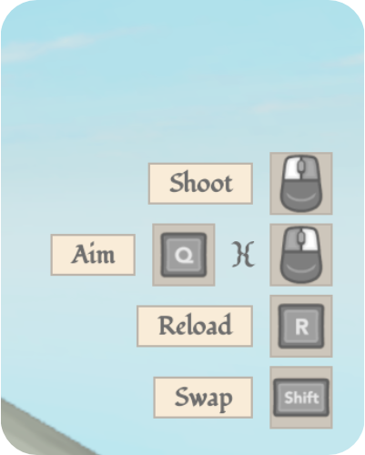
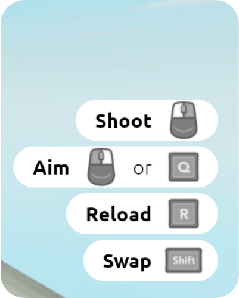
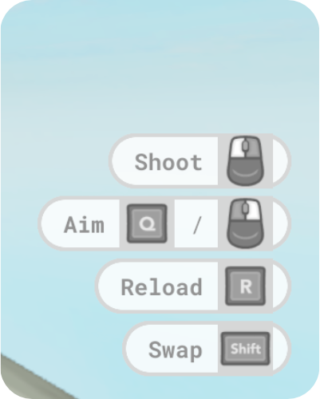
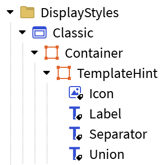

# Display Styles

## Overview

Display styles can be found under the `DisplayStyles` Folder under `Configuration`. These are ScreenGuis which Control Hints uses to display generated hints.

??? info "Preview Display Styles"
    Control Hints comes with 5 display styles:
    
    <div class="grid cards" markdown>
    
    - `Classic`
    
        Default display style for Control Hints, inspired by Roblox CoreGui.
    
        {.display-preview}
    
        Recommended icon set: `Kenney`
    
    - `Compact`
    
        Smaller profile to avoid distracting the player from the game.
    
        {.display-preview}
    
        Recommended icon set: `Kenney`
    
    - `Fantasy`
    
        Decorative display style to use in RPGs and the sort.
    
        {.display-preview}
    
        Recommended icon set: `Xelu_Dark`
    
    - `Light`
    
        Similar to the `Classic` display style, it has a compact form and is a good choice for more casual, playful games.
    
        {.display-preview}
    
        Recommended icon set: `Xelu_Dark`
    
    - `SciFi`
    
        Futuristic theme to complement action or sci-fi games.
    
        {.display-preview}
    
        Recommended icon set: `Xelu_Dark`
    
    </div>
    
## Creating Display Styles

Control Hints makes it easy to create display styles and modify existing ones.

### Structure

It's important that certain instances of a name and class are present within the display style in order for Control Hints to function properly.

{ width="30%" }

A display style must contain:

- `Container` Frame to contain all UI elements.
    - `TemplateHint` Frame, which is what Control Hints clones to generate hints.
        - `Icon` ImageLabel to display an icon of a KeyCode.
        - `Label` TextLabel to display the name of the InputAction.
        - Optionally, `Separator` GuiObject to convey a separation between multiple KeyCodes.
            - Example: "X *or* Y to jump"
        - Optionally, `Union` GuiObject to convey a union between multiple KeyCodes.
            - Example: "X *and* Y to jump"

These are the minimum required elements. You can modify beyond this to sort hints with UIListLayout, or to add background elements to the hint Frame.

!!! info "Using Dynamic Scaling?"
    A UISizeConstraint is required for the `Icon` ImageLabel, the `Separator` GuiObject, and the `Union` GuiObject, and a UITextSizeConstraint for the `Label` TextLabel. If the `Separator` and the `Union` are TextLabels, then they should contain a UITextSizeConstraint.

### Loading

To select your new display style, ensure it is parented under the `DisplayStyles` Folder under `Configuration`, as all the other display styles. Then, update the `DISPLAY_STYLE` setting in [`Settings`](settings.md) to reference your display style:

```luau
-- Select a Control Hints display style
Settings.DISPLAY_STYLE = DisplayStyles.Classic
```

Now, when you test your game, Control Hints will use your display style. If there are any issues with it, Control Hints should error/warn with details on what needs fixing. If you encounter errors, ensure that the [structure](#structure) is sound before reporting to the [DevForum thread](https://devforum.roblox.com/t/control-hints-show-your-ias-bindings-pc-xbox-playstation-mobile/3978604)
