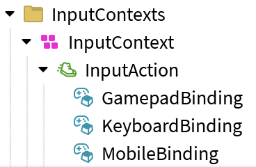

# Getting Started

## Installation

1. Download the latest model from the [Roblox Creator Store](https://create.roblox.com/store/asset/87894581499695/Control-Hints) or the `control-hints-creator-store-model.rbxm` file from the [GitHub repository](https://github.com/btc7274/control-hints).

2. Insert the model into Roblox Studio and ungroup the folders. Check:
    - The ModuleScript `ControlHints` should be in `ReplicatedStorage`.
    - The LocalScript `ControlHintsManager` should be in `StarterGui`.

3. Create a Folder in `StarterPlayer → StarterPlayerScripts` to contain your Input Action System. See the [Basic IAS Setup](#basic-ias-setup) section for an example.

4. In the LocalScript `ControlHintsManager`, update the constant `IAS_SETUP` to reference your new folder:
```lua
-- Adjust as needed:
local ControlHints = require(ReplicatedStorage.ControlHints)
local IAS_SETUP = player.PlayerScripts:WaitForChild("IasSetup")
```

5. Control Hints should now be working when you test your game. See [UI Styling](#ui-styling) next.

## Basic IAS Setup

Organize your IAS setup folder like this:

{ width="30%" }

Control Hints uses the standard IAS setup, which is InputContext → InputAction → InputBinding.

### Naming

#### InputActions

By default, the name of the InputAction is what will be displayed in the UI. You can change this behavior by setting a [`CustomName` attribute](customization/attributes.md) (string) to the InputAction.

#### InputBindings

InputBindings show on different platforms depending on the start of their name:

- Names starting with `Keyboard` → shown on PC
- Names starting with `Gamepad` → shown on console
- Names starting with `Mobile` → shown on touch devices

## UI Styling

Edit the `Settings` ModuleScript (under `Configuration` in the main module) to choose:

- `ICON_SET` (default: Kenney) to change the look of control hint icons.
- `DISPLAY_STYLE` (default: Classic) to change the look of the UI.

```lua
-- Select a Control Hints icon set
Settings.ICON_SET = require(IconSets.Kenney)


-- Select a Control Hints display style
Settings.DISPLAY_STYLE = DisplayStyles.Classic
```

See [Customization](customization.md) for more information on styling.
