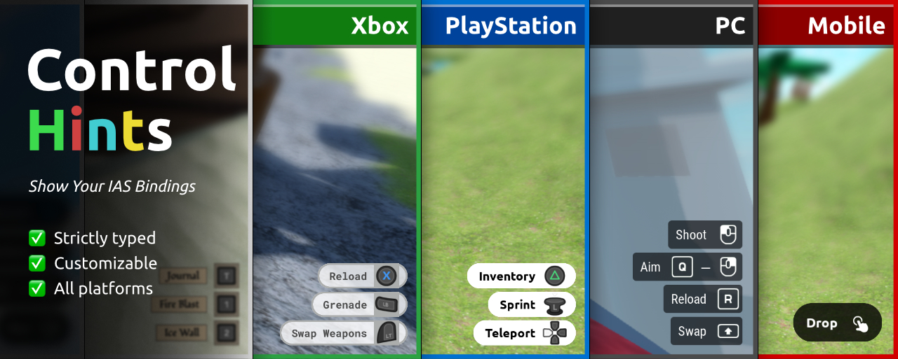

# Control Hints Documentation

**Version 1.91** (April 1, 2026)

Control Hints is a lightweight Luau module for Roblox that automatically generates professional control hint UI elements based on the [Input Action System (IAS)](https://create.roblox.com/docs/input/input-action-system).

It supports keyboard/mouse, Xbox, PlayStation, and mobile inputs with platform-specific icons, responsive feedback, dynamic scaling, and easy customization.

## Key Features

- Seamless integration with Input Action System (InputContext → InputAction → InputBinding)
- Automatic platform detection and icon switching
- Support for key combinations (modifiers + primary key)
- Responsive icons (visual press feedback)
- Dynamic scaling for console players
- Clean and performant with strict type checking

For a live demonstration, explore the [uncopylocked FPS demo](https://www.roblox.com/games/134115175730196/Control-Hints-FPS).

## Links

- [Getting Started](getting-started.md)
- [GitHub Repository](https://github.com/btc7274/control-hints)
- [DevForum Thread](https://devforum.roblox.com/t/control-hints-show-your-ias-bindings-pc-xbox-playstation-mobile/3978604)
- [API Reference](api-reference.md)
- [Customization](customization.md)

---

**License**: MIT  
**Created by**: ZurichBT (Roblox username)
